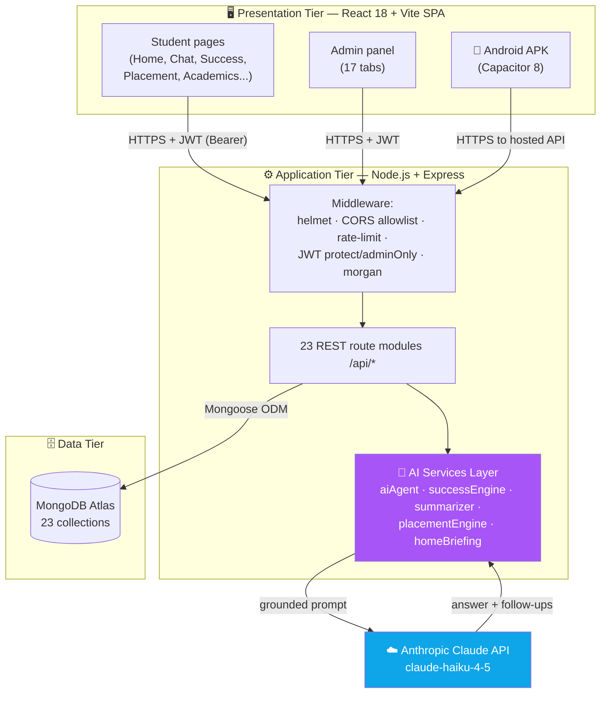
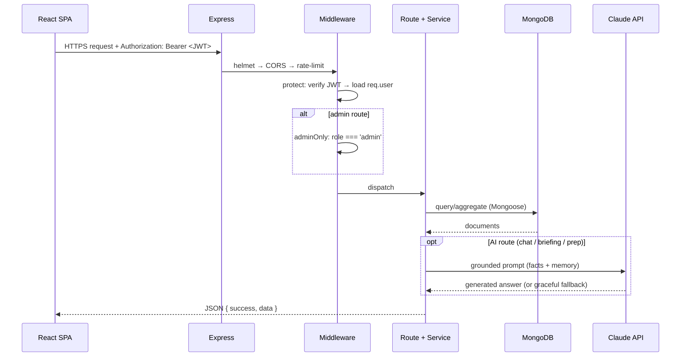
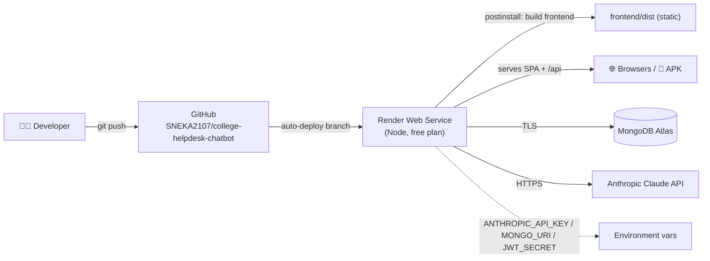

# System Architecture Diagram

CampusAssist AI is a classic **three-tier SPA** (presentation → application/API → data) with an **AI services layer** and an external **LLM provider**. Diagrams use Mermaid (renders on GitHub).

## 2.1 High-level architecture

## 2.2 Request lifecycle (authenticated API call)

## 2.3 Deployment topology

## 2.4 Architectural principles

1. **Single deployable unit** — Express serves both the API (`/api/*`) and the built React SPA (`frontend/dist`) with an SPA catch-all fallback; one Render service, no separate CDN.
2. **Stateless API** — JWT bearer tokens; no server sessions, so the API scales horizontally.
3. **Thin routes, rich services** — routes handle HTTP/validation; the 5 AI engines hold business logic and are independently unit-testable and reusable (e.g. `successEngine` is reused by Copilot, Home and Placement).
4. **Graceful AI degradation** — every Claude call has a deterministic fallback (retrieval-only answer / heuristic summary / template plan), so the app fully functions even without an API key.
5. **Defense in depth** — helmet + CSP, CORS allowlist, layered rate limits, input sanitization, audit logging, hashed credentials.
6. **Citations by construction** — the retrieval layer records a source for every fact it injects, so answers are always traceable.
