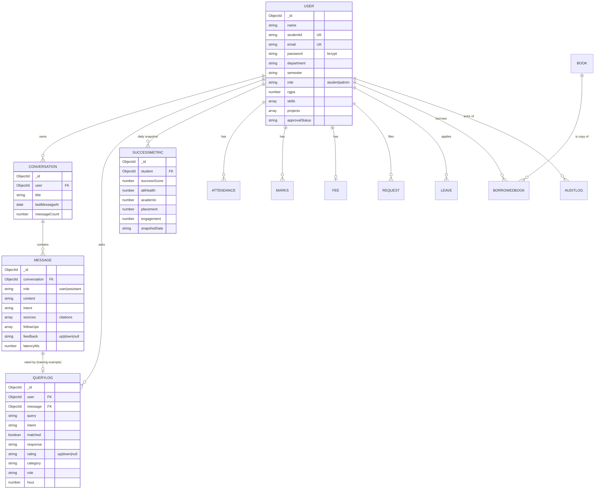
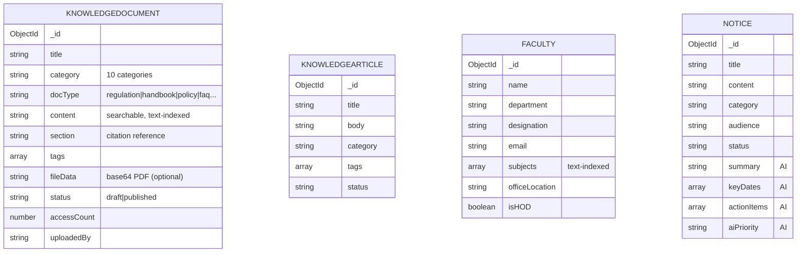
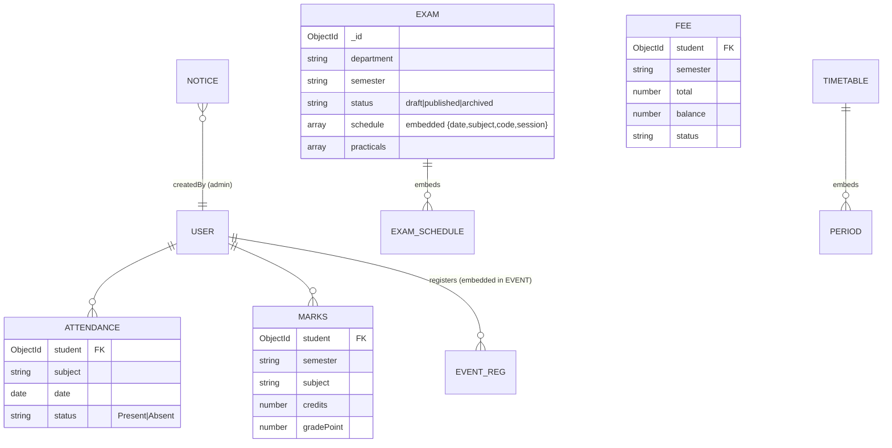

# Database ER Diagram

MongoDB (document) database, 23 collections. References below are `ObjectId` links (Mongoose `ref`). Diagram uses Mermaid `erDiagram`.

## 3.1 Core entity relationships

## 3.2 Knowledge & directory entities (Phase 7)

*These four are not foreign-key joined to USER — they are the institutional knowledge corpus the Copilot retrieves from at query time (RAG sources).*

## 3.3 Academic & service entities

## 3.4 Schema design notes

- **Document references over embedding** for high-cardinality, independently-queried data (attendance, marks, messages). **Embedding** for tightly-bound sub-documents that are always read together (exam `schedule[]`, timetable periods, event registrations, message `sources[]`).
- **Text indexes** on `KnowledgeArticle`, `KnowledgeDocument`, `Faculty` power keyword retrieval for the Copilot (upgrade path: Atlas Vector Search via the reserved `embedding` field).
- **`QueryLog` is the training corpus** — each row is a labelled `(query → response, rating, intent, category, role)` example, linked to its `Message`. Additive Phase-7 fields keep it backward compatible.
- **`SuccessMetric`** stores one upserted snapshot per student per day → enables trend charts on the Success/Home/Placement dashboards.
- **Soft compatibility** — lifecycle/audience/AI fields default so legacy rows created before a feature existed still validate and render.
