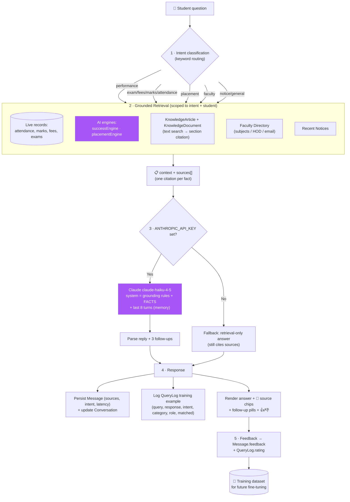
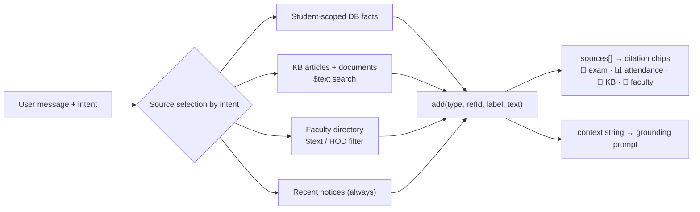
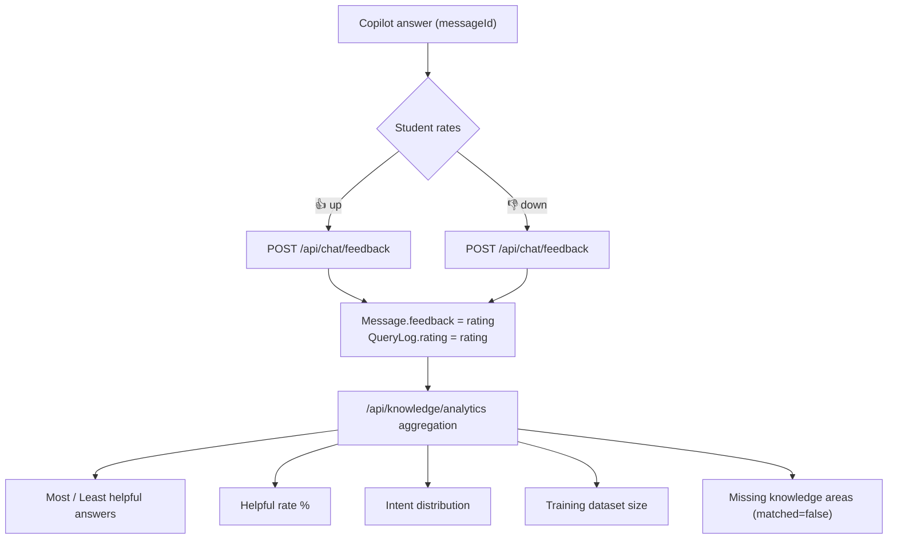
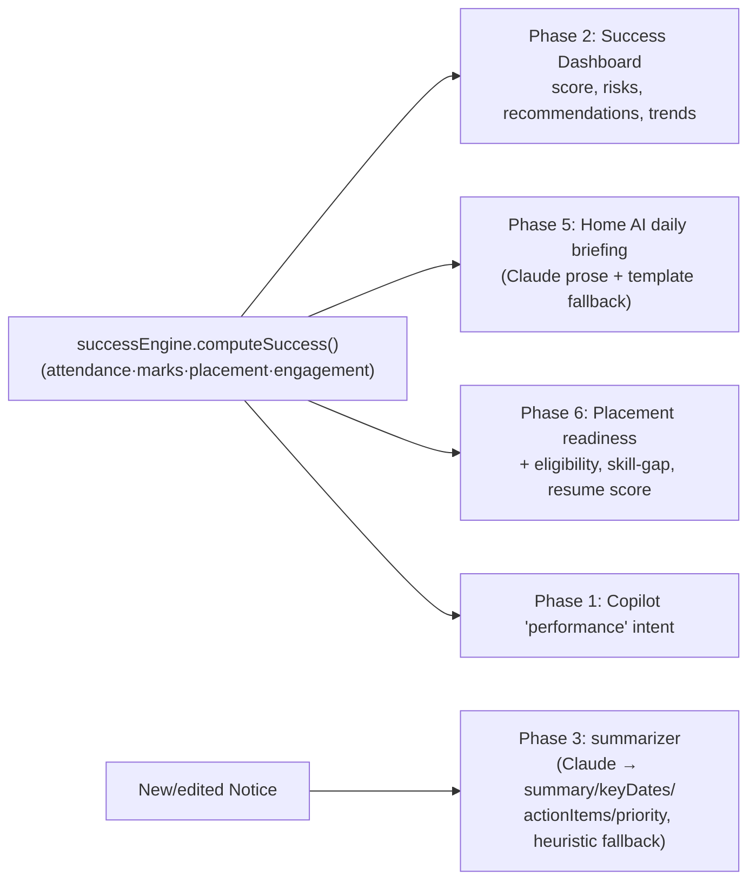

# AI Workflow Diagram

The Campus Copilot is a **grounded (RAG-style) assistant**: deterministic intent classification → scoped retrieval with source tracking → Claude generation with conversation memory → persistence + training-data capture. Every Claude call has a deterministic fallback.

## 4.1 End-to-end Copilot pipeline

## 4.2 Retrieval grounding (Module 2 — RAG)

## 4.3 Feedback → training-data loop (Modules 3 & 4)

## 4.4 Other AI flows (reuse `successEngine` as the single source of truth)

## 4.5 Design rationale

- **Deterministic intent routing** (not an LLM classifier): cheap, predictable, fully testable, and logged for analytics — appropriate for a campus assistant where the source domains are known.
- **Retrieve-then-generate (RAG)**: Claude answers *only* from injected FACTS, eliminating hallucinated dates/fees/grades and guaranteeing every claim is citable.
- **Conversation memory**: last 8 turns are replayed so follow-ups ("and the next one?") resolve in context.
- **Graceful degradation**: the demo never breaks — without an API key the Copilot returns the grounded retrieval text and the summarizer/briefing use heuristics/templates.
- **Closed feedback loop**: thumbs ratings flow into `QueryLog`, turning routine usage into a labelled dataset that quantifies answer quality and surfaces knowledge gaps — the foundation for future fine-tuning (Phase 7's stated goal).
